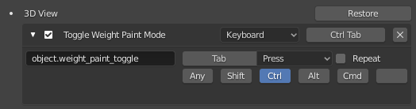
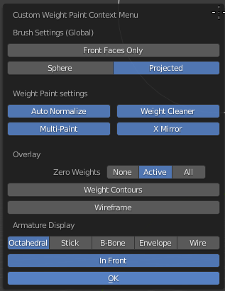
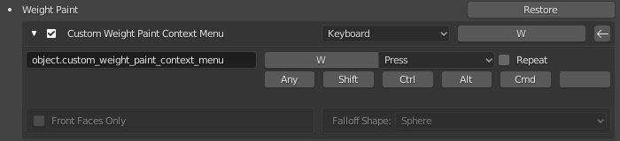
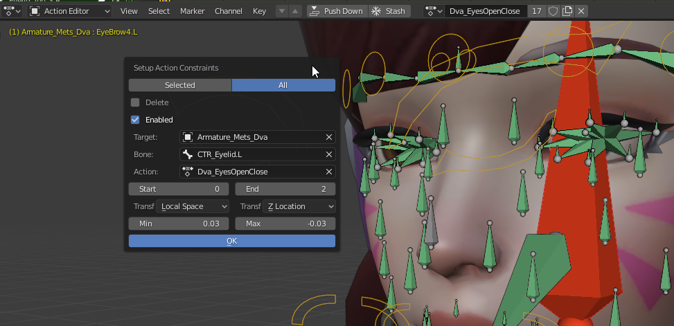

This addon is my random set of operators that I made to make my rigging workflow as painless as possible.  
There may be some extra stuff beside what's documented - assume that stuff is WIP.  
You can install this like any other Blender Addon - Download as zip, then in Blender go to Preferences->Addons->Install From File and browse the zip you downloaded.

# Weight Painting Operators

### Change Brush
The addon will force-register keybinds for this operator to the 1, 2, 3 keys in Weight Paint mode:  
1: Change to Add Brush.  
2: Change to Subtract Brush.  
3: Change to Blur Brush.  
The brushes must have their default name, ie. "Add", "Subtract", "Blur".  

### Toggle Weight Paint Mode
This operator lets you switch into weight paint mode properly. 
Select your object and run the operator.  
It will find the first armature modifier of your mesh, if there is one. It will ensure the armature is visible and in pose mode.  
It will set the shading settings to a pure white.  
If you entered weight paint mode with this operator, you should also get used to leaving weight paint mode with it. When leaving weight paint mode with the operator, it will restore the visibility settings of the armature, and restore the previous shading settings.  
I recommend setting up a keybind for this, eg.:  
  

### Weight Paint Context Menu
This is meant to replace the default Weight Paint Context menu.  
  
_(The "OK" button is not needed, I just can't avoid it)_  
It lets you change the brush falloff type (Sphere/Projected) and the Front Faces Only option. These will affect ALL brushes.  
Also, the color of your brushes will be darker when you're using Sphere falloff.  
Since this is meant to replace something, you can overwrite the shortcut of the default weight paint context menu(which is pretty useless):  
  

### Toggle Weight Cleaner
This is a new functionality found in the custom WP context menu. When enabled, **this will run the Clean Vertex Groups operator after every brush stroke** while you're in weight paint mode. This is useful when you're using Auto-Normalize(which you should be) because it has an issue where it adds weights to 0-weights, resulting in small weight islands showing up all over the mesh as you work. The weight cleaner lets you avoid this by removing 0-weights as soon as they appear.  

# Rigging Operators

### X-Mirror Constraints
Mirrors all constraints and drivers on a rig, assuming everything ends in .L/.R.  
Driver mirroring is WIP/hardcoded to my workflow and naming, don't rely on it. Constraint mirroring should work really nicely though.

### Setup Action Constraints
This operator is to help rig faces using Action constraints.  
  

It shows a popup with settings for the Action constraints that will be created.  
If there is already an Action constraint in the rig that targets the currently active Action, it pre-fills the popup with that constraint's settings. They can also be deleted or disabled.  
Pressing OK will set all the constraints targetting this action to the specified settings.  
For bones whose names don't end in .L/.R, we assume they are in the center of the face. It will create two copies of the constraint, one for the left and one for the right side, both with an influence of 0.5.  

### Assign Bone Group (armature.assign_group)
This is meant to replace the default Ctrl+G menu in pose mode.  
  

### Force Apply Mirror Modifier
Force apply mirror modifier on the active object by duplicating it, flipping it on the X axis, merging into the original. It will also flip vertex groups, shape keys, shape key masks, and even drivers on shape keys, assuming everything is named with .L/.R suffixes.

### Apply Armature Scale
This operator will apply uniform scale to a rigged armature while maintaining its constraints. It also applies the scaling to all actions used by the rig's Action constraints. (Optinally all actions in the whole scene)

#### Join As Shape Key By UVs
For when you have two meshes with identical topology and UVs, and want to combine them so you can blend from one to the other with a shape key. Just select both and run the operator.  

#### Refresh Drivers
Sometimes drivers in Blender decide to just fall asleep, or claim to have an error when they don't. Run this operator to refresh them, to make sure they don't complain about errors that don't exist.  

#### Reload Proxied Library
If you have a linked and proxied character in a scene, you can use this to re-load that linked and proxied rig from another file, another collection, and even another rig, while preserving the rig's action and local constraints.  (Used when renaming directly linked stuff during production)  

# Cleanup Operators

#### Delete Unused Material Slots.
This is the same as the built-in "Remove Unused Slots" operator, except it can work on all selected objects, or all objects, instead of just the active object.

#### Cleanup Mesh
Similar deal here, WIP.  

# Misc Operators
### Convert Images
Converts all images of a certain extension referenced by this blend file according to the render settings of the scene.  
Images must be saved outside of the .blend file.  
Could also use a better popup probably, WIP.  