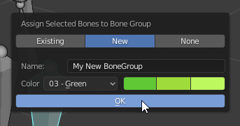

This addon is a set of operators I use to boost my rigging workflow.  
Stuff I used to use but don't use anymore lives in the legacy folder, with no guarantee of usefulness or functionality.  
There may be some extra stuff beside what's documented - assume that stuff is WIP.  
You can install this like any other Blender Addon - Download as zip, then in Blender go to Preferences->Addons->Install From File and browse the zip you downloaded.  

# Weight Painting Operators
These operators have been split to a separate addon: [Easy Weight](https://gitlab.com/blender/easy-weight)
I highly recommend using that addon too, since half of rigging is weight painting. That addon was also written with much higher standards and is much better maintained.

# Rigging Operators

### Symmetrize Selected Bones
Pose Mode: Pose->Symmetrize Selected Bones
Uses Blender's built-in Symmetrize operator (which was inspired by an older implementation of this operator!), but with some tweaks:
- Works in pose mode (will do the mode switching for you).
- Remove any existing drivers from the target side.
- Mirror drivers in simple cases.

### Assign Bone Group
This is meant to replace the default Ctrl+G menu in pose mode.  
  

### Refresh Drivers
Sometimes drivers in Blender decide to just fall asleep, or claim to have an error when they don't. Run this operator to refresh them, to make sure they don't complain about errors that don't exist.  

### Apply Armature Scale
This operator will apply uniform scale to a rigged armature while maintaining its constraints. It also applies the scaling to all actions used by the rig's Action constraints. (Optinally all actions in the whole scene)
